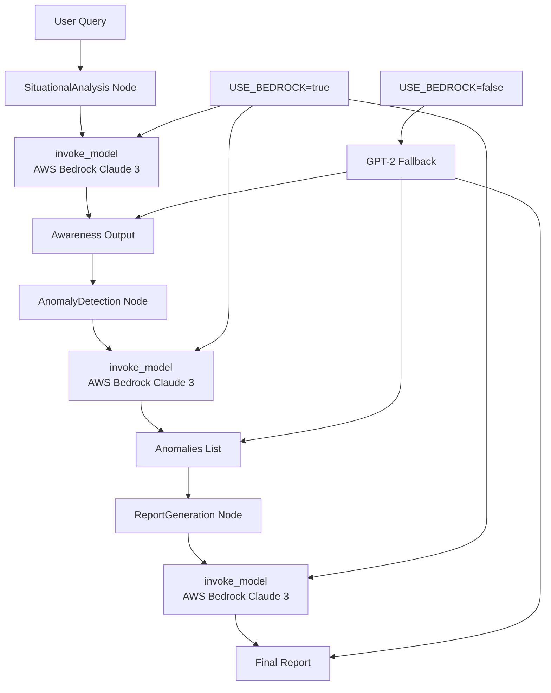
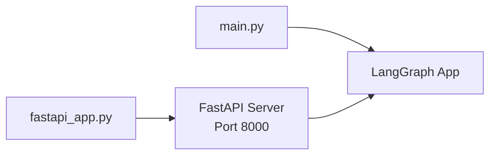
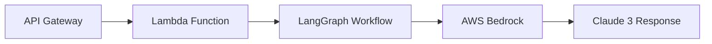

# Defense AI Agentic App Architecture

## Overview
This application implements a modular agentic AI workflow for defense/intelligence analysis using LangGraph, AWS Bedrock, and MCP/A2A protocols.

## Core Architecture

## Components

### LangGraph Workflow
- **StateGraph**: Manages the agentic workflow state
- **AgentState**: TypedDict containing query, awareness, anomalies, report
- **Nodes**: Modular processing units connected in sequence

### AI Integration
- **Primary**: AWS Bedrock with Claude 3 Sonnet (us.anthropic.claude-3-sonnet-20240229-v1:0)
- **Fallback**: Local GPT-2 via Transformers (for offline/testing)
- **Configuration**: Controlled by USE_BEDROCK environment variable

### Deployment Options

#### Local Development

#### Cloud Deployment

## Data Flow
1. User submits query via API (local or cloud)
2. SituationalAnalysis node analyzes the query for awareness
3. AnomalyDetection node identifies anomalies in awareness data
4. ReportGeneration node creates comprehensive report
5. Results returned as JSON with all intermediate outputs

## Security & Configuration
- AWS Credentials via boto3 (IAM roles in Lambda)
- Environment variables for Bedrock toggle
- MCP/A2A protocols for tool exposure
- CloudFormation for infrastructure as code